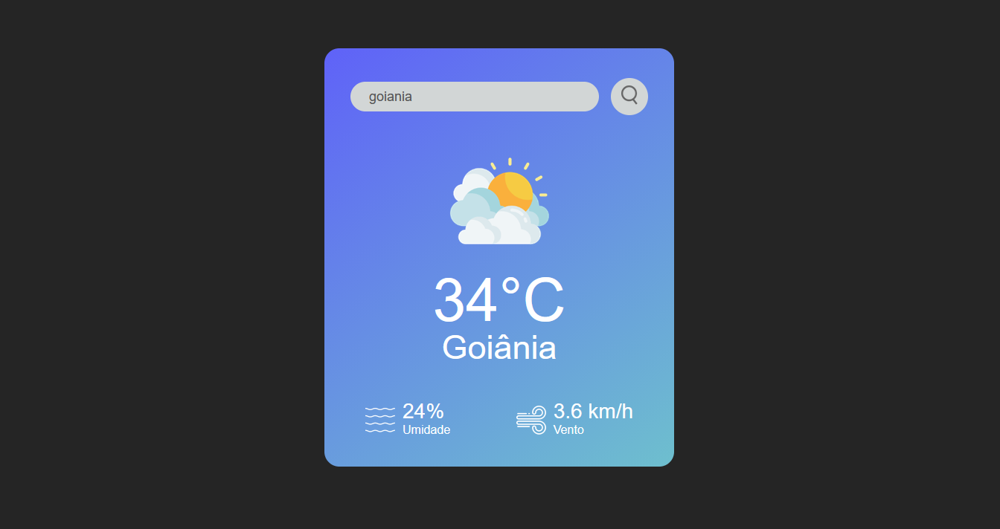

# Weather App

A simple web app that shows the current temperature, humidity, and wind speed for any city you search.



## Features

- Search weather by city name
- Displays current temperature, humidity, and wind speed
- Clean, responsive UI

## Tech Stack

- HTML, CSS, JavaScript
- [OpenWeather API](https://openweathermap.org/api)

## Getting Started

1. Clone the repo:
```bash
   git clone https://github.com/isadorara/weather-app
```
2. Get a free API key from [OpenWeather](https://openweathermap.org/api).
3. Add your API key (e.g., in a config file or environment variable, depending on your setup).
4. Open `index.html` in your browser.

## What I Learned

This project was built to practice working with APIs in JavaScript — fetching data, handling async requests, and using the response to update the DOM dynamically.

## Credits

Built by following the tutorial [*How To Make Weather App Using JavaScript Step By Step Explained*](https://youtu.be/MIYQR-Ybrn4?si=m4ti60UWdFOqVLvs) by **GreatStack**. Images used are from the same creator.